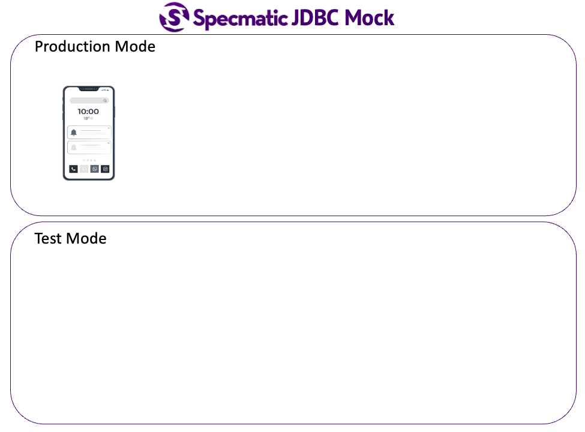

# Specmatic JDBC Stub Demo

This project demonstrates how we can stub database dependencies with Specmatic JDBC stub.

## Architectural overview

## Context

In order to test our applications in isolation, we often need to isolate them from their dependencies such as databases.
There are several options (in-memory databases, dockerizing your DB setup, etc.). However, there are limitations to each of these approaches.
* In-memory DBs usually cannot handle any DDL, DML syntax and data types that may be proprietary to your DB.
* While Dockerised DB setup may address the above issue to an extent, it requires some initial effort to achieve a DB setup that has parity with your production instance (Especially in legacy applications that lack proper automated DB deployment mechanisms).

## Solution

Specmatic JDBC dependency is a completely wire-compatible setup that has none of the above limitations.
It is able to seamlessly emulate a JDBC datasource so that your application thinks it is talking to the real database.
This makes for a realist test setup that can be quickly spun up.

## Private Beta

Specmatic JDBC Stub is currently in private beta. Please contact us at https://specmatic.in if you wish to try it out.
